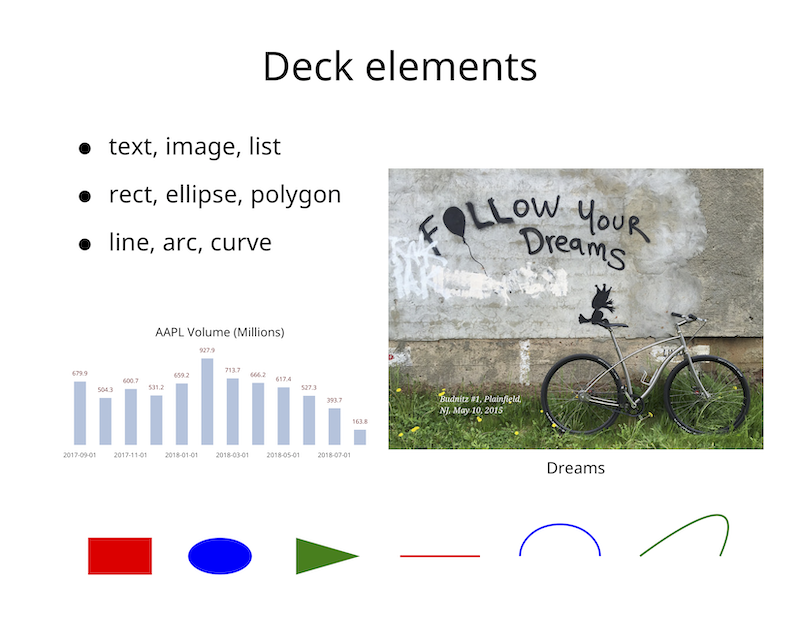

# decksh: a little language for deck markup

```decksh``` is a domain-specific language (DSL) for generating [```deck```](https://github.com/ajstarks/deck/blob/master/README.md) markup.

## Package use

There is a simple method ```Process``` that reads decksh commands from an ```io.Reader``` and writes deck markup to an  ```io.Writer```, returning an error.


## Running

This repository also contains ```cmd/decksh```, a client decksh command:

```decksh``` reads from the specified input, and writes deck markup to the specified output destination:

    $ decksh                   # input from stdin, output to stdout
    $ decksh -o foo.xml        # input from stdin, output to foo.xml
    $ decksh foo.sh            # input from foo.sh output to stdout
    $ decksh -o foo.xml foo.sh # input from foo.sh output to foo.xml

Typically, ```decksh``` acts as the head of a rendering pipeline:

    $ decksh text.dsh | pdf -pagesize 1200,900 

## Example input

This deck script:

    // Example deck
    midx=50
    midy=50
    iw=640
    ih=480

    imfile="follow.jpg"
    imlink="https://budnitzbicycles.com"
    imscale=58
    dtop=87

    opts="-fulldeck=f -textsize 1  -xlabel=2  -barwidth 1.5"
    deck
        slide "white" "black"
            ctext "Deck elements" midx dtop 5
            cimage "follow.jpg" "Dreams" 72 midy iw ih imscale imlink
            textblock "Budnitz #1, Plainfield, NJ, May 10, 2015" 55 35 10 1 "serif" "white"

            // List
            blist 10 75 3
                li "text, image, list"
                li "rect, ellipse, polygon"
                li "line, arc, curve"
            elist

            // Graphics
            gy=10
            c1="red"
            c2="blue"
            c3="green"
            rect    15 gy 8 6              c1
            ellipse 27.5 gy 8 6            c2
            polygon "37 37 45" "7 13 10"   c3
            line    50 gy 60 gy 0.25       c1
            arc     70 gy 10 8 0 180 0.25  c2
            curve   80 gy 95 25 90 gy 0.25 c3


            // Chart
            chleft=10
            chright=45
            chtop=42
            chtbottom=28
            dchart -left chleft -right chright -top chtop -bottom chbottom opts AAPL.d 
        eslide
    edeck


Produces:



Text, font, color, caption and link arguments follow Go convetions (surrounded by double quotes).
Colors are in rgb format ("rgb(n,n,n)"), hex ("#rrggbb"), or [SVG color names](https://www.w3.org/TR/SVG11/types.html#ColorKeywords).

Coordinates, dimensions, scales and opacities are floating point numbers ranging from from 0-100 
(they represent percentages on the canvas width and percent opacity).  Some arguments are optional, and 
if omitted defaults are applied (black for text, gray for graphics, 100% opacity).

Canvas size and image dimensions are in pixels.

## Simple assignments

```id=<number>``` defines a constant, which may be then subtitited. For example:

    x=10
    y=20
    text "hello, world" x y 5

## Assignment operations

```id+=<number>``` increment the value of ```id``` by ```<number>```

    x+=5

```id-=<number>``` decrement the value of ```id``` by ```<number>```

    x-=10

```id*=<number>``` multiply the value of ```id``` by ```<number>```

    x*=50

```id*=<number>``` divide the value of ```id``` by ```<number>```

    x/=100

## Binary operations

Addition ```id=<id> + number or <id>```

    tx=10
    spacing=1.2
    
    sx=tx-10
    vx=tx+spacing

Subtraction ```id=<id> - number or <id>```

    a=x-10

Muliplication ```id=<id> * number or <id>```

    a=x*10

Division ```id=<id> / number or <id>```

    a=x/10

## Begin or end a deck.

    deck
    edeck

## Begin, end a slide with optional background and text colors.

    slide [bgcolor] [fgcolor]
    eslide

## Specify the size of the canvas.

    canvas w h


## Random Number

	x=random min max

assign a random number in the specified range

## Square Root

return the square root of the number of expression (```id``` or binary operation)

    a=4
    b=10
    x=sqrt 4
    x=sqrt a+b
    x=sqrt b

## Mapping

    x=vmap v vmin vmax min max

For value ```v```, map the range ```vmin-vmax``` to ```min-max```.

## Polar Coordinates

    x=polarx cx cy r theta
    y=polary cx cy r theta

Return the polar coordinate given a center at ```(cx, cy)```, radius ```r```, and angle ```theta``` (in degrees)

## Area

    a=area d

return the circular area, ```a``` for the diameter ```d```.

## Formatted Text

Assign a string variable with formatted text (using package fmt floating point format strings)

    w1=10
	w2=20+100

	s0=format "Widget 1: %.2f" w1
	s1=format "Widget 2: %.3f" w2
	st=format "Total Widgets: %v" s1+w2

## Loops

Loop over ```statements```, with ```x``` starting at ```begin```, ending at ```end``` with an optional ```increment``` (if omitted the increment is 1). 
Substitution of ```x``` will occur in statements.

    for x=begin end [increment]
        statements
    efor

Loop over ```statements```, with ```x``` ranging over the contents of items within ```[]```.
Substitution of ```x``` will occur in statements.

    for x=["abc" "def" "ghi"]
        statements
    efor

Loop over ```statements```, with ```x``` ranging over the contents ```"file"```.
Substitution of ```x``` will occur in statements.

    for x="file"
        statements
    efor


## Text

Left, centered, end, or block-aligned text (```x``` and ```y``` are the text's reference point), or a file's contents with  optional font ("sans", "serif", "mono", or "symbol"), color and opacity.

    text       "text"     x y size       [font] [color] [opacity] [link]
    ctext      "text"     x y size       [font] [color] [opacity] [link]
    etext      "text"     x y size       [font] [color] [opacity] [link]
    textblock  "text"     x y width size [font] [color] [opacity] [link]

Text rotated along the specified angle (in degrees)

    rtext      "text"     x y angle size [font] [color] [opacity] [link]

Text on an arc centered at ```(x,y)```, with specified radius, between begin and ending angles (in degrees).
if the beginning angle is less than the ending angle the text is rendered counter-clockwise.
if the beginning angle is greater than the ending angle, the text is rendered clockwise.

    arctext    "text"     x y radius begin-angle end-angle size [font] [color] [opacity] [link]

Place the contents of "filename" at (x,y). Place the contents of "filename" in gray box, using a monospaced font.
   
    textfile   "filename" x y       size [font] [color] [opacity] [linespacing]
    textcode   "filename" x y width size [color]

## Images

Plain and captioned, with optional scales, links and caption size. ```(x, y)``` is the center of the image,
and ```width``` and ```height``` are the image dimensions in pixels.

    image  "file"           x y width height [scale] [link]
    cimage "file" "caption" x y width height [scale] [link] [size]

## Lists

(plain, bulleted, numbered, centered). Optional arguments specify the color, opacity, line spacing, link and rotation (degrees)

    list   x y size [font] [color] [opacity] [linespacing] [link] [rotation]
    blist  x y size [font] [color] [opacity] [linespacing] [link] [rotation]
    nlist  x y size [font] [color] [opacity] [linespacing] [link] [rotation]
    clist  x y size [font] [color] [opacity] [linespacing] [link] [rotation]

### list items, and ending the list

    li "text"
    elist

## Graphics

Rectangles, ellipses, squares, circles: specify the center location ```(x, y)``` and 
dimensions ```(w,h)``` with optional color and opacity.
The default color and opacity is gray, 100%.  In the case of the ```acircle``` keyword, the ```a``` argument
is the area, not the diameter.

    rect    x y w h [color] [opacity]
    ellipse x y w h [color] [opacity]

    square  x y w   [color] [opacity]
    circle  x y w   [color] [opacity]
    acircle x y a   [color] [opacity]

Rounded rectangles are similar, with the added radius for the corners: (solid colors only)

    rrect   x y w h r [color]

For polygons, specify the x and y coordinates as a series of numbers, with optional color and opacity.

    polygon "xcoords" "ycoords" [color] [opacity]

Note that the coordinates may be either discrete:

    polygon "10 20 30" "50 60 50"

or use substitution:

    x1=10
    x2=20
    x3=30
    y1=50
    y2=y1+10
    y3=y1
    polygon "x1 x2 x3" "y1 y2 y3"

A combination of constants and substitution is also allowed.

    polygon "20 x2 30" "50 y2 50"

For lines, specify the coordinates for the beginning ```(x1,y1)``` and end points ```(x2, y2)```. 
For horizontal and vertical lines specify the initial point and the length.
Line thickness, color and opacity are optional, with defaults (0.2, gray, 100%).

A "pill" shape has is a horizontal line with rounded ends.

    line    x1 y1 x2 y2 [size] [color] [opacity]
    hline   x y length  [size] [color] [opacity]
    vline   x y length  [size] [color] [opacity]
    pill    x w length  size   [color]

Curve is a quadratic Bezier curve: specify the beginning location ```(bx, by)```, 
the control point ```(cx, cy)```, and ending location ```(ex, ey)```.

For arcs, specify the location of the center point ```(x,y)```, the width and height, and the beginning and ending angles (in degrees). Line thickness, color and opacity are optional, with defaults (0.2, gray, 100%).

    curve   bx by cx cy ex ey [size] [color] [opacity]
    arc     x y w h a1 a2     [size] [color] [opacity]

To make n-sided stars, use the "star" keyword: ```(x,y)``` is the center of the star, 
```np``` is the number of points, and ```inner``` and ```outer``` are the sizes of
the inner and outer points, respectively.

    star    x y np inner outer [color] [opacity]

## Arrows

Arrows with optional linewidth, width, height, color, and opacity.
Default linewidth is 0.2, default arrow width and height is 3, default color and opacity is gray, 100%.
The curve variants use the same syntax for specifying curves.

    arrow   x1 y1 x2 y2       [linewidth] [arrowidth] [arrowheight] [color] [opacity]
    lcarrow bx by cx cy ex ey [linewidth] [arrowidth] [arrowheight] [color] [opacity]
    rcarrow bx by cx cy ex ey [linewidth] [arrowidth] [arrowheight] [color] [opacity]
    ucarrow bx by cx cy ex ey [linewidth] [arrowidth] [arrowheight] [color] [opacity]
    dcarrow bx by cx cy ex ey [linewidth] [arrowidth] [arrowheight] [color] [opacity]

## Braces

Left, right, up and down-facing braces.
(x, y) is the location of the point of the brace, and linewidth, color and opacity are optional
(defaults are gray, 100%)

    lbrace x y height aw ah [linewidth] [color] [opacity]
    rbrace x y height aw ah [linewidth] [color] [opacity]
    ubrace x y width  aw ah [linewidth] [color] [opacity]
    dbrace x y width  aw ah [linewidth] [color] [opacity]

## Charts

Run the [dchart](https://github.com/ajstarks/dchart/blob/master/README.md) command with the specified arguments.

    dchart [args]

## Legend

Show a colored legend

    legend "text" x y size [font] [color]


## Include decksh markup from a file

    include "file"

places the contents of ```"file"``` inline.

## Functions

    func "file" arg1 ... argn

include the contents of the file, substituting arguments

For example, given a file "ftest.dsh"

    def ftest funx funy funs funt
        funs*=2
        ctext funt funx funy funs
    edef

calling the function:

    func "ftest.dsh" 50 30 2.5 "hello"

produces:

    funx=50
    funy=30
    funs=5.0
    funt="hello"
    ctext "hello" 50 30 5.0

## Data: Make a file

    data "foo.d"
    uno    100
    dos    200
    tres   300
    edata

makes a file named ```foo.d``` with the lines between ```data``` and ```edata```. 

## Grid: Place objects on a grid

    grid "file.dsh" x y xskip yskip limit

The first file argument (```"file.dsh"``` above) specifies a file with decksh commands; each item in the file must include the arguments "x" and "y". Normal variable substitution occurs for other arguments. For example if the contents of ```file.dsh``` has six items:

    circle x y 5
    circle x y 10
    circle x y 15
    square x y 5
    square x y 10
    square x y 15

The line:

    grid "file.dsh" 10 80 20 30 50

creates two rows: three circles and then three squares

```x, y``` specify the beginning location of the items, ```xskip``` is the horizontal spacing between items.
```yinternal``` is the vertical spacing between items and ```limit``` the the horizontal limit. When the ```limit``` is reached, 
a new row is created.

