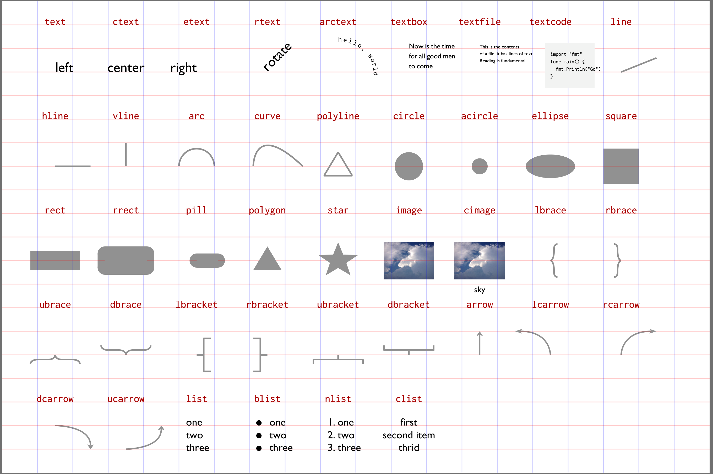
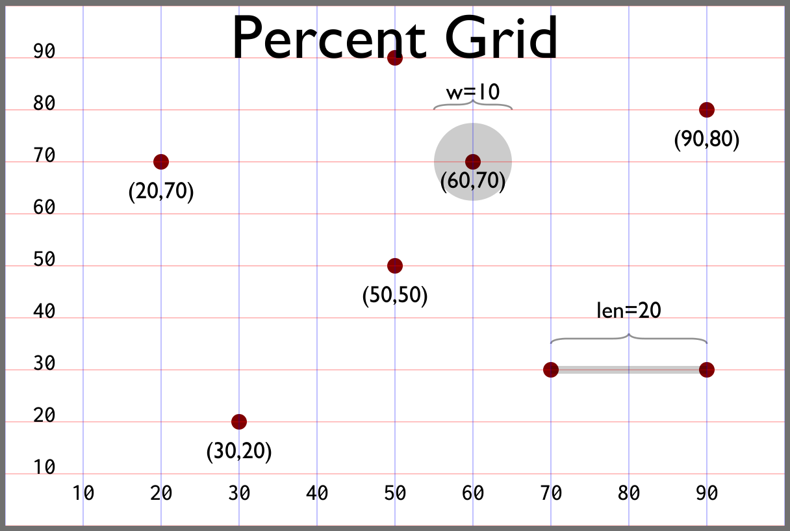

# decksh: a little language for presentations, visualizations, and information displays


`decksh` is a domain-specific language (DSL) for generating [`deck`](https://github.com/ajstarks/deck) markup.



`decksh` elements


## Install

```
go get github.com/ajstarks/decksh                        # install the package
go install github.com/ajstarks/decksh/cmd/decksh@latest  # install the decksh command
```
The current version is 2025-08-12-1.0.0

## References and Examples

- [`decksh` overview](https://speakerdeck.com/ajstarks/decksh-a-little-language-for-decks)
- [`decksh` object reference](https://speakerdeck.com/ajstarks/decksh-object-reference)
- [Installing and Running decksh/pdfdeck](https://speakerdeck.com/ajstarks/pdfdeck)
- [Repository of decksh projects and visualizations](https://github.com/ajstarks/deckviz "Repository of decksh projects and visualizations")

## Package use

The `Process` function reads decksh commands from an `io.Reader` and writes deck markup to an `io.Writer`, returning an error.

For example:
```
package main

import (
    "fmt"
    "os"
    "strings"

    "github.com/ajstarks/decksh"
)

func main() {
    input := `
    deck
        slide
            ctext "hello, world" 50 50 10
        eslide
    edeck
    `
    err := decksh.Process(os.Stdout, strings.NewReader(input))
    if err != nil {
        fmt.Fprintf(os.Stderr, "%v\n", err)
    }
}
```

Produces:

```
<deck>
<slide>
<text align="c" xp="50" yp="50" sp="10" >hello, world</text>
</slide>
</deck>
````

## Running the command line client

This repository also contains `cmd/decksh`, a client decksh command:

`decksh` reads from the specified input, and writes deck markup to the specified output destination:

```
$ decksh                   # input from stdin, output to stdout
$ decksh -o foo.xml        # input from stdin, output to foo.xml
$ decksh foo.sh            # input from foo.sh output to stdout
$ decksh -o foo.xml foo.sh # input from foo.sh output to foo.xml
$ decksh -version          # show decksh version
$ decksh -dump ...         # show decksh variables
```

Typically, `decksh` acts as the head of a rendering pipeline, where another `deck` client renders the markup. This example uses `pdfdeck`

```
$ decksh text.dsh | pdfdeck -stdout -pagesize 1200,900 - > text.pdf
```

## Example input

decksh hello, world:

```
// hello world
deck
    slide "black" "white"
        ctext "hello world" 50 25 15
        circle 0 0 120 "blue"
    eslide
edeck
```

produces:


This deck script:

```
// Example deck
midx=50
midy=50
iw=640
ih=480

imfile="follow.jpg"
imlink="https://budnitzbicycles.com"
imscale=58
dtop=87

opts="-fulldeck=f -textsize 1  -xlabel=2  -barwidth 1.5"
deck
    slide "white" "black"
        ctext "Deck elements" midx dtop 5
        cimage "follow.jpg" "Dreams" 72 midy iw ih imscale imlink
        textblock "Budnitz #1, Plainfield, NJ, May 10, 2015" 55 35 10 1 "serif" "white"

        // List
        blist 10 75 3
            li "text, image, list"
            li "rect, ellipse, polygon"
            li "line, arc, curve"
        elist

        // Graphics
        gy=10
        c1="red"
        c2="blue"
        c3="green"
        rect    15 gy 8 6              c1
        ellipse 27.5 gy 8 6            c2
        polygon "37 37 45" "7 13 10"   c3
        line    50 gy 60 gy 0.25       c1
        arc     70 gy 10 8 0 180 0.25  c2
        curve   80 gy 95 25 90 gy 0.25 c3


        // Chart
        chleft=10
        chright=45
        chtop=42
        chtbottom=28
        dchart -left chleft -right chright -top chtop -bottom chbottom opts AAPL.d
    eslide
edeck
```

Produces:


Text, font, color, caption and link arguments follow Go conventions (surrounded by double quotes).

## Coordinate System

`decksh` (like the deck markup it produces) uses a traditional Cartesian
coordinate system:  The origin (0,0) is at the lower left, x increases to the
right, and y increases upwards. The coordinate system is  expliticly based on
the percentages, with x and y ranging from 0-100. For example (50, 50) is the
middle of the canvas, (100,100) is the upper right, (100,0) is the lower
right, and (0,100) is the upper left.



## Rulers

Make rulers with an interval (default 5), with optional color

```ruler [increment] [color]```


## Colors

Colors formats are:

- [RGB](https://en.wikipedia.org/wiki/RGB_color_model "RGB"): "rgb(n,n,n)", where n ranges from 0-255, for example "`"rgb(128,0,128)"` .
- hex: "#rrggbb", for example `"#aa00aa"`,
- [HSV](https://en.wikipedia.org/wiki/HSL_and_HSV "HSV"): hsv(hue,saturation,value), hue ranges from 0-360, saturation and value range from 0-100, for example `"hsv(360,30,30)"` (pdfdeck and pngdeck support this syntax)
- [SVG color names](https://www.w3.org/TR/SVG11/types.html#ColorKeywords "SVG color names").

Color gradients (used for slide backgrounds and rectangle and square fills) are specified as color1/color2/percent, for example, `"blue/white/90"`

## Coordinates, dimensions, scales, opacity and fonts

Coordinates, dimensions, scales and opacities are floating point numbers
ranging from from 0-100 (representing percentages of the canvas width and
percent opacity). Some arguments are optional, and if omitted defaults are
applied (black for text, gray for graphics, 100% opacity).

Canvas size and image dimensions are in pixels.

Fonts may be:

- "sans"
- "serif"
- "mono"
- symbol"


## Begin or end a deck.

```
deck
edeck
```

## Begin, end a slide with optional background and text colors.

```
slide [bgcolor] [fgcolor]
eslide
```

Note that doc/edoc and page/epage are may also be used as synomyms for deck/edeck and slide/eslide.

## Specify the size of the canvas.

```
canvas w h
```

## Simple assignments

`id=<number>` defines a constant, which may be then subtitited. For example:

```
x=10
y=20
text "hello, world" x y 5
```

The special identifier, `deckshVersion` contains the string denoting the version of decksh.

## Assignment operations

`id+=<number>` increment the value of `id` by `<number>`

```
x+=5
```

`id-=<number>` decrement the value of `id` by `<number>`

```
x-=10
```

`id*=<number>` multiply the value of `id` by `<number>`

```
x*=50
```

`id*=<number>` divide the value of `id` by `<number>`

```
x/=100
```

## Binary operations

Addition `id=<id> + number or <id>`

```
tx=10
spacing=1.2

sx=tx-10
vx=tx+spacing
```

Subtraction `id=<id> - number or <id>`

```
a=x-10
```

Muliplication `id=<id> * number or <id>`

```
a=x*10
```

Division `id=<id> / number or <id>`

```
a=x/10
```

Modulo `id=<id> % number or <id>`

a=x%10

## Coordinate assignments

Assign (x,y) coordinates to the specified identifier.  The x coordinate is
`id_x` and the y coordinate is `id_y`.  The expression with the parentheses
may be a constant, variable or binary expression.

This code:

```
    a=40
    b=40
    c=20

    p0=(50,50)
    p1=(a,b)
    p2=(a+c,b)
    p3=(a+c,b+c)
    p4=(a,b+c)

    circle p0_x p0_x 3
    line p1_x p1_y p2_x p2_y 0.2 "blue"
    line p2_x p2_y p3_x p3_y 0.2 "red"
    line p3_x p3_y p4_x p4_y 0.2 "green"
    line p4_x p4_y p1_x p1_y 0.2 "orange"
```

makes this:


## Polar Coordinates

```
x=polarx cx cy r theta
y=polary cx cy r theta
```

Return the polar coordinate given the center at `(cx, cy)`, radius `r`, and angle `theta` (in degrees)


## Polar Coordinates (composite)

```
p=polar cx cy r theta
```

Return the polar coordinates `(p_x)` and `(p_y)` given the center at `(cx, cy)`, radius `r`, and angle `theta` (in degrees)

## Dump

The keyword `dump` causes a sorted list of variables and their values to
be printed on standard error.

For example, given:

```
deck
    slide
        x=50
        y=50
        s=5
        message="Hello, decksh"
        ctext message  x y s
    eslide
    dump
edeck
```
Produces:
```
deckshVersion   = "2024-12-15-1.0.0"
message         = "Hello, decksh"
s               = 5
x               = 50
y               = 50
```

You can also specify that specific variables are shown, `dump x y` shows:

```
x               = 50
y               = 50
```


## Area

```
a=area d
c=area a+b
```

return the circular area, `a` for the diameter `d`.

## Formatted Text

Assign a string variable with formatted text (using package fmt floating point format strings). Up to five variables may be used.

```
w1=10
w2=20+100

s0=format "Widget 1: %.2f" w1
s1=format "Widget 2: %.3f" w2
st=format "Total Widgets: %v" s1+w2
```

Large numbers may also be formatted with commas using the `%,` format string. For example:

```
s=format "%," 123456789  // s contains 123,456,789
```

## Random Number

```
x=random min max
```


assign a random number in the specified range

## Math Functions

decksh supports these math functions:

- cosine
- sine
- square root
- tangent

### Cosine

return the coine of the number of expression (`id` or binary operation)

```
a=4
b=10
x=cosine 4
x=cosine a+b
x=cosine b
```

### Sine

return the sine of the number of expression (`id` or binary operation)

```
a=4
b=10
x=sine 4
x=sine a+b
x=sine b
```

### Square Root

return the square root of the number of expression (`id` or binary operation)

```
a=4
b=10
x=sqrt 4
x=sqrt a+b
x=sqrt b
```

### Tangent

return the square root of the number of expression (`id` or binary operation)

```
a=4
b=10
x=tangent 4
x=tangent a+b
x=tangent b
```

## Range Value Mapping

```
x=vmap v vmin vmax min max
```


For value `v`, map the range `vmin-vmax` to `min-max`.

## Substring

```
x=substr string begin end
```

assigns a substring given beginning and ending indicies.
`-` may be used as a shorthand for the beginning and end.

```
s="hello, world"
a=substr s - -                  // a="hello, world"
b=substr s - 4                  // b="hello"
c=substr s 7 -                  // c="world"
d=substr s 3 8                  // d="lo, wo"
e=substr "This is a test"  5 8  // e="is a"
```

## Loops

Loop over `statements`, with `x` starting at `begin`, ending at `end` with an
optional `increment` (if omitted the increment is 1). Substitution of `x`
will occur in statements.

```
for x=begin end [increment]
    statements
efor
```

Loop over `statements`, with `x` ranging over the contents of items within `
[]`.  Substitution of `x` will occur in statements.

```
for x=["abc" "def" "ghi"]
    statements
efor
```

Loop over `statements`, with `x` ranging over the contents `"file"`.
Substitution of `x` will occur in statements.

```
for x="file"
    statements
efor
```

## Conditionals

Specify the conditional execution of decksh statements with `if condition`,
`else` and `eif`. The else block is optional. The values for ```v1``` and
```v2``` may be either numbers of strings. (For strings only ```==``` and
```!=``` apply). The conditions are:

```
if v1 condition v2

where condition is:
== or eq   equals                 if x == y
!= or ne   not equals             if x != y
<  or lt   less than              if x > y
>  or gt   greater than           if x < y
>= or ge   greater than or equal  if x >= y
<= or ge   less than or equal     if x <= y
>< or bt   between                if x >< y z
```

For example:

```
x=10
y=20
if x > y
    text "x is greater than y" x y 5
else
    text "x is not greater than y" x y 5
eif
```

The else block may be omitted:

```
if x < 10
    text "x is less than 10" x y 5
eif
```

For strings:

```
c1="red"
c2="blue"
if c1 != c2
    text "red is not blue" 50 50 2
eif
```


## Include decksh markup from a file

```
include "file"
```

places the contents of `"file"` inline.

## Functions

Functions have a defined `name` and arguments, and are specifed with
statements between the `def` and `edef` keywords

```
def name arg1 arg2 ... argn
    statements
edef
```

## Importing function defintions

Functions may be imported once, and then called by name.

For example, given a file `redcircle.dsh`:

```
def redcircle X Y
    circle X Y 10 "red"
edef
```

which is referenced:

```
import "redcircle.dsh"
x=50
y=50
x2=x-20
y2=y+20
redcircle x y
redcircle x2 y2
```

makes:


Functions may also be called with the `func` keyword:

```
func "file" arg1 ... argn
```

For example, given a file "ftest.dsh"

```
def ftest funx funy funs funt
    funs*=2
    ctext funt funx funy funs
edef
```

calling the function:

```
func "ftest.dsh" 50 30 2.5 "hello"
```

produces:

```
funx=50
funy=30
funs=5.0
funt="hello"
ctext "hello" 50 30 5.0
```

## Data: Make a file

```
data "foo.d"
uno    100
dos    200
tres   300
edata
```

makes a file named `foo.d` with the lines between `data` and `edata`.

## Grid: Place objects on a grid

```
grid "file.dsh" x y xskip yskip limit
```


The first file argument (`"file.dsh"` above) specifies a file with decksh
commands; each item in the file must include the arguments "x" and "y".
Normal variable substitution occurs for other arguments. For example if the
contents of `file.dsh` has six items:

```
circle x y 5
circle x y 10
circle x y 15
square x y 5
square x y 10
square x y 15
```

The line:

```
grid "file.dsh" 10 80 20 30 50
```

creates two rows: three circles and then three squares

`x, y` specify the beginning location of the items, `xskip` is the horizontal
spacing between items.  `yinternal` is the vertical spacing between items and
`limit` the the horizontal limit. When the `limit` is reached,  a new row is
created.


## Text

Left, centered, end, or block-aligned text or file contents (`x` and `y` are the text's reference point), with optional font ("sans", "serif", "mono", or "symbol"), color and opacity.

### left-aligned text

```
text       "text"     x y size       [font] [color] [opacity] [link]
btext      "text"     x y size       [font] [color] [opacity] [link]
```


### centered text

```
ctext      "text"     x y size       [font] [color] [opacity] [link]
```


### right-aligned text

```
etext      "text"     x y size       [font] [color] [opacity] [link]
```


### a text block (from either a string or the contents of a file)

```
textblock     "text"     x y width size [font] [color] [opacity] [link]
textblockfile "filename" x y width size [font] [color] [opacity] [link]
```


Text rotated along the specified angle (in degrees)

```
rtext      "text"     x y angle size [font] [color] [opacity] [link]
```

### rotated text


### text on an arc

Text on an arc centered at `(x,y)`, with specified radius, between begin and
ending angles (in degrees).  if the beginning angle is less than the ending
angle the text is rendered counter-clockwise.  if the beginning angle is
greater than the ending angle, the text is rendered clockwise.

```
arctext    "text"     x y radius begin-angle end-angle size [font] [color] [opacity] [link]
```


### text from file contents (plain and code formatted)

Place the contents of "filename" at (x,y). Place the contents of "filename" in
gray box, using a monospaced font.

```
textfile   "filename" x y       size [font] [color] [opacity] [linespacing]
```


```
textcode   "filename" x y width size [color]
```


## Images

Plain and captioned, with optional scales, links and caption size. `(x, y)` is
the center of the image,  and `width` and `height` are the image dimensions
in pixels.

```
image  "file"           x y width height [scale] [link]
cimage "file" "caption" x y width height [scale] [link] [size]
```


## Lists

(plain, bulleted, numbered, centered). Optional arguments specify the color,
opacity, line spacing, link and rotation (degrees)

```
list   x y size [font] [color] [opacity] [linespacing] [link] [rotation]
```


```
blist  x y size [font] [color] [opacity] [linespacing] [link] [rotation]
```


```
nlist  x y size [font] [color] [opacity] [linespacing] [link] [rotation]
```


```
clist  x y size [font] [color] [opacity] [linespacing] [link] [rotation]
```


### list items, and ending the list

```
li "text"
elist
```

## Graphics

Rectangles, ellipses, squares, circles: specify the center location `(x, y)`
and  dimensions `(w,h)` with optional color and opacity.  The default color
and opacity is gray, 100%. In the case of the `acircle` keyword, the `a`
argument  is the area, not the diameter.

```
rect    x y w h [color] [opacity]
ellipse x y w h [color] [opacity]
```


```
square  x y w   [color] [opacity]
circle  x y w   [color] [opacity]
```


```
acircle x y a   [color] [opacity]
```


Rounded rectangles are similar, with the added radius for the corners:
(solid colors only)

```
rrect   x y w h r [color]
```


For polygons, specify the x and y coordinates as a series of numbers, with
optional color and opacity.

```
polygon "xcoords" "ycoords" [color] [opacity]
```


Note that the coordinates may be either discrete:

```
polygon "10 20 30" "50 60 50"
```

or use substitution:

```
x1=10
x2=20
x3=30
y1=50
y2=y1+10
y3=y1
polygon "x1 x2 x3" "y1 y2 y3"
```

A combination of constants and substitution is also allowed.

```
polygon "20 x2 30" "50 y2 50"
```

Polyline is similar to polygon, except line segments are used instead of a filled polygon, and you may specify a line width.

```
polyline "xcoords" "ycoords" [lw] [color] [opacity]
```


For lines, specify the coordinates for the beginning `(x1,y1)` and end points
`(x2, y2)`.  For horizontal and vertical lines specify the initial point and
the length.  Line thickness, color and opacity are optional, with defaults
(0.2, gray, 100%).

A "pill" shape has is a horizontal line with rounded ends.

```
line    x1 y1 x2 y2 [size] [color] [opacity]
```


```
hline   x y length  [size] [color] [opacity]
```


```
vline   x y length  [size] [color] [opacity]
```


```
pill    x w length  size   [color]
```


Curve is a quadratic Bezier curve: specify the beginning location `(bx, by)`,
the control point `(cx, cy)`, and ending location `(ex, ey)`.

For arcs, specify the location of the center point `(x,y)`, the width and
height, and the beginning and ending angles (in degrees). Line thickness,
color and opacity are optional, with defaults (0.2, gray, 100%).

```
curve   bx by cx cy ex ey [size] [color] [opacity]
```


```
arc     x y w h a1 a2     [size] [color] [opacity]
```


To make n-sided stars, use the "star" keyword: `(x,y)` is the center of the
star,  `np` is the number of points, and `inner` and `outer` are the sizes of
the inner and outer points, respectively.

```
star    x y np inner outer [color] [opacity]
```


## Arrows

Arrows with optional linewidth, width, height, color, and opacity.  Default
linewidth is 0.2, default arrow width and height is 3, default color and
opacity is gray, 100%.  The curve variants use the same syntax for specifying
curves.

```
arrow   x1 y1 x2 y2       [linewidth] [arrowidth] [arrowheight] [color] [opacity]
```


```
lcarrow bx by cx cy ex ey [linewidth] [arrowidth] [arrowheight] [color] [opacity]
```


```
rcarrow bx by cx cy ex ey [linewidth] [arrowidth] [arrowheight] [color] [opacity]
```


```
ucarrow bx by cx cy ex ey [linewidth] [arrowidth] [arrowheight] [color] [opacity]
```


```
dcarrow bx by cx cy ex ey [linewidth] [arrowidth] [arrowheight] [color] [opacity]
```


## Braces

Left, right, up and down-facing braces. (x, y) is the location of the point of
the brace, (aw, ah) are width and height of the braces's  end curves;
`linewidth`, `color` and `opacity` are optional (defaults are 0.2, gray,
100%)

```
lbrace x y height aw ah [linewidth] [color] [opacity]
```


```
rbrace x y height aw ah [linewidth] [color] [opacity]
```


```
ubrace x y width  aw ah [linewidth] [color] [opacity]
```


```
dbrace x y width  aw ah [linewidth] [color] [opacity]
```


## Brackets

Left, right, up and down-facing brackets.

(x, y) is the location of the center of the bracket.  For left and
right-facing brackets, `width` is the size of the top and bottom portions,
and `height` is the span of the bracket.  For upward and downward-facing
brackets, `width` is the span of of bracket, and `height` is the size of the
left and right portions. `linewidth`, `color` and `opacity` are optional
(defaults are 0.2, gray, 100%)

```
lbracket x y width height [linewidth] [color] [opacity]
```


```
rbracket x y width height [linewidth] [color] [opacity]
```


```
ubracket x y width height [linewidth] [color] [opacity]
```


```
dbracket x y width height [linewidth] [color] [opacity]
```


## Charts

Run the [dchart](https://github.com/ajstarks/dchart/blob/master/README.md "dchart") command with the specified arguments.

```
dchart [args]
```


## Legend

Show a colored legend

```
legend "text" x y size [font] [color]
```


# Geographic Features


Using data from either:

* [Shapefiles](https://desktop.arcgis.com/en/arcmap/latest/manage-data/shapefiles/what-is-a-shapefile.htm)
* [KML files](https://pro.arcgis.com/en/pro-app/latest/help/data/kml/what-is-kml-.htm)
* [geoJSON files](https://datatracker.ietf.org/doc/html/rfc7946)
* sets of lat/long pairs

geographic features may be rendered. Supported are:

* geographic regions, borders and paths
* plain and labeled locations
* images at geographic locations

Appropriate geoJSON, KML and Shapefiles may be obtained from the [opendatasoft site](https://public.opendatasoft.com/explore/dataset/world-administrative-boundaries/export/)


The map above is rendered by this code:

```
deck
    wcolor="lightblue"
    lcolor="sienna"
    gcolor="white"
    geoLatMin=20
    geoLatMax=45
    geoLongMax=48
    geoLongMin=5
    slide wcolor gcolor
        text       "The Ancient World" 10 10 5
        georegion  "world.kml"    lcolor
        geoborder  "world.kml"    0.05 wcolor
        geolabel   "countries.d"  3 "serif" gcolor
        geoloc     "cities.d"     "c" 1 "sans" gcolor
    eslide
edeck
```

(Note: to ensure proper layout, set the -layers option to "poly:ellipse:text:line" in your deck rendering tool.)

The geographic bounding box of the map is defined by latitude (geoLatMin, geoLatMax) and longitude (geoLongMin, geoLongMax) in decimal degrees.  Latitudes range from -90° to 90° and longitudes range from -180° to 180°.

The Equator is at 0° latitude; latitudes to the north of the Equator are positive, and latitudes south of the Equator are negative.

The Prime Meridian is 0° longitude; longitudes to the east of this point are positive, longitudes to the west are negative.

Once the ```geoLatMin, geoLatMax, geoLongMin, geoLongMax``` variables are set, geographic functions will use them implicitly. If these special variables are not set, the default values (-90,90,-180,180) are used.


Further, the canvas boundaries for geographic functions are: ```geoXmin, geoXmax``` for the width and ```geoYmin, geoYmax``` for the height. If these special variables are not set the default values (0,100) are used.

For example to show the African continent (bound by 37.347N to 34.8333S and 17.52W to 51.267E) to on a specified portion of the canvas (40,70) and (30,70):

```
geoLatMax=37.346983
geoLatMin=0-34.833222
geoLongMax=51.266667
geoLongMin=0-17.520278

geoXmin=40
geoYmax=70
geoYmin=30
geoXmax=70
```


## Regions


Reads data from the specified KML, geoJSON or Shapefile and renders the regions.

A file with the suffix ".kml" is assumed to be in KML format. Files with suffix ".json" or "geojson" are processed as geoJSON, and a file with the ".shp" suffix is assumed to be a Shapefile.


```color``` and ```op``` specify the color and opacity.

```
georegion  "file" [color] [op]
```

## Borders


Reads data from the specified file and renders the borders. ```lw``` is the line width, ```color``` and ```op``` specify the color and opacity.

```
geoborder "file" [lw] [color] [op]
```
## Labels


Reading from the specified file, or a geo coordinate string, place text at a latitude and longitude. The fields in the file are tab-separated latitude, longitide, and label.  Labels with embedded "\n" means the text will be stacked. (for example "Atlantic\nOcean").

A file of coordinates looks like this:
```
26.3351 17.2283 Libya
26.8206 30.8025 Egypt
39.0742 21.8243 Greece
38.9637 35.2433 Turkey
41.8719 12.5674 Italy
32.4279 53.6880 Iran
33.2232 43.6793 Iraq
34.0000 09.0000 Tunisia
```

Coordinate strings may be either a string with tab separated values:
```
"+26.3351   17.2283 Libya"
```
or [geo URI](https://en.wikipedia.org/wiki/Geo_URI_scheme) like this:
```
geo:26.3351,17.2283
```

```
geolabel "file.d"                      [size] [font] [color] [op]
geolabel "+41.8719   12.5674   Italy"  [size] [font] [color] [op]
geolabel "geo:41.8719,12.5674   Italy" [size] [font] [color] [op]
```
## Locations


Reading data from the specified file or coordinate string, place text and a dot. The text may be center-above ("c"), center-underneath ("u"), begin ("b"), or end ("e") aligned in relation to the dot.

```
geoloc "location" align [size] [font] [color] [op]
```
Place a marker at the locations specified in the specified file or coordinate string.


```
geomark "location" [size] [color]
```

Connect the points found in the specified file with straight lines.
```
geopathfile  "file"  [size] [color]
```
Connect two points with either straight lines or curves


```
geopath "point1" "point2" [size] [color] [op]
geoarc  "point1" "point2" [size] [color] [op]
````

## Images on maps


```
geoimage "loc" image-width image-height
```

Place image(s) at location(s)

The location is specified by lat/long and name of the image.  The ```loc``` argument may be either a geo URL and a name, or a list of coordinates and names in a file.

For example:

```
geoimage "geo:48.8588897,2.3200410    fra.png" 10 0
```
places the image in "fra.png" at the coordinates of Paris, France.
