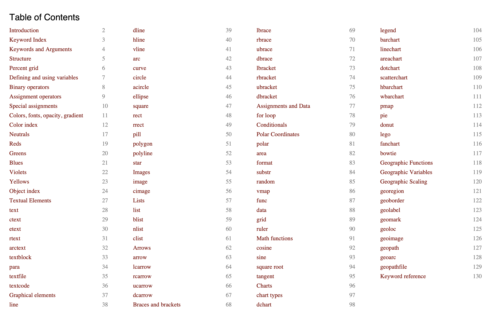

# dshtoc -- make a table of contents of a decksh file

```dshtoc [options] [files...]```



dshtoc reads decksh files and creates a decksh file that reflects the table of contents with names and slide (page) numbers.  

By default ```dshtoc``` writes to standard output, and reads from standard input if no files are specified.

The output may then be included into the source file:

```
dshtoc -o toc.dsh input.dsh
```

within input.dsh:

```
include "toc.dsh"
```

dshtoc looks for specially formatted comments (// TOC: ...) to designate an item to be added to the index:

```
// TOC: Introduction
slide ....
	...
eslide
```

The command line options specify how the text is laid out. The items are formatted into columns, with ```-cw``` setting the column width, and ```-items``` specifying the number of items per column. 

Other options control the size, line spacing, color, and font of the text. The top and left margin positions of the TOC also may be specified.

If the decksh file contains ```include``` the included pages are counted, but ```// TOC:``` comments are not processed. Also, if there are too many items to fit on the page, they are not shown.  This can be mitigated by adjusting ```-items```, ```-cw``` and ```-ls```.

The ```-dump``` option shows the TOC items sorted by page on standard error:
```
Introduction                        2
Keyword Index                       3
Keywords and Arguments              4
Structure                           5
Percent grid                        6
Defining and using variables        7
Binary operators                    8
Assignment operators                9
Special assignments                 10
...
geopath                             127
geoarc                              128
geopathfile                         129
Keyword reference                   130
```

## Command line options

### Text attributes:

```
  -color string
    	text color
     
  -font string
    	font (default "sans")
     
  -title string
    	TOC Title (default blank)
```
     
### Positioning and layout:
  
```
  -cw float
    	name column width % (default 30)
     
  -items int
    	items per column (default 20)
     
  -left float
    	left margin % (default 5)
     
  -ls float
    	line spacing % (default 1.2)
     
  -size float
    	font size % (default 1.5)
     
  
  
  -top float
    	top of the page % (default 85)
```
     
  ### File handling: 
  
  ```
  -dir string
    	input directory (default ".")
 
  -o string
    	output file (default blank)
  ```
  
 ### Debugging:
 
 ```
  -dump
    	dump TOC
```
